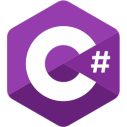
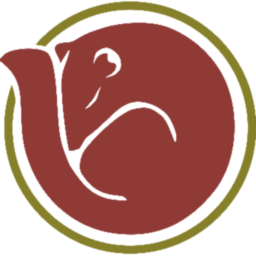
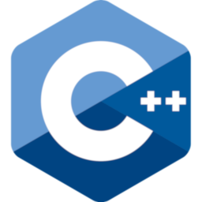
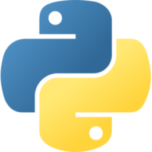
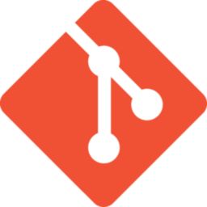
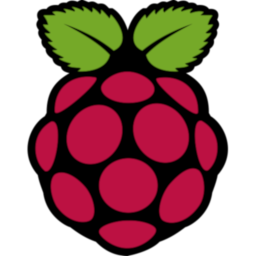
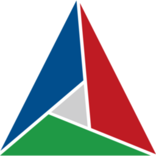
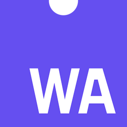

</img>

- :computer: Software Engineer I at [Codeweavers](https://www.codeweavers.net/), working in Backend.
- :student: First-class CS Alumni from [Staffordshire University](https://www.staffs.ac.uk/), with a specialization in Software Development and Engineering.
- :video_game: Former background in GameDev, with previous experience as a Games Tester.
 

</img>

In professional roles, I've worked with:

<table align="center">
<tr>
<td align="center">

C#
</td>
<td align="center">

.NET
</td>
<td align="center">

NUnit
</td>
<td align="center">

PostgreSQL
</td>
<td align="center">

SQL Server
</td>
<td align="center">

NHibernate
</td>
<tr>
</table>

Through my own projects or curiosity, I have also worked with:

<table align="center">
<tr>
<td align="center">

Ubuntu / Debian
</td>
<td align="center">

C++
</td>
<td align="center">

Python
</td>
<td align="center">

Git
</td>
<td align="center">

Bash
</td>
<td align="center">

Raspberry Pi OS
</td>
<td align="center">

Qt
</td>
<td align="center">

CMake
</td>
</tr>
<tr>
<td align="center">

Microsoft Azure
</td>
<td align="center">

JavaScript
</td>
<td align="center">

WebAssembly
</td>
<td align="center">

GitHub Actions
</td>
</tr>
</table>

*I am also [AZ-900 (Microsoft Azure Fundamentals) Certified](https://learn.microsoft.com/en-gb/users/not-ed/credentials/84505f8dcf8a6f35)* :grin:.

</img>

<!-- Content is removed and re-populated here automatically by Github actions, do not put anything here manually.-->
<!-- HISTORY_START -->

> ### Thu. 26 December
>
>  "[Added GitHub Actions to list of tech knowledge](https://github.com/not-ed/not-ed/commit/aac80cfbfccf2bebb0ec66726538d16c972d33e0)" in [not-ed/not-ed](https://github.com/not-ed/not-ed).

> ### Mon. 18 November
>
>  Starred [lighttigerXIV/catppuccinifier](https://github.com/lighttigerXIV/catppuccinifier).

> ### Sun. 17 November
>
>  "[Made parts of 'About Me' a little less verbose](https://github.com/not-ed/not-ed.github.io/commit/079f6cbc9c85856ea07fa28043daef18f2f99a94)" in [not-ed/not-ed.github.io](https://github.com/not-ed/not-ed.github.io).
>
>  "[Added Microsoft Azure to skills](https://github.com/not-ed/not-ed/commit/cd99bc62089b733c7f4125162ff766cdcc57d03e)" in [not-ed/not-ed](https://github.com/not-ed/not-ed).
>
>  "[Put JS and WASM skills on own rows](https://github.com/not-ed/not-ed/commit/9253401fbcfdd84d0a8085f1a95ee5aba5243b7c)" in [not-ed/not-ed](https://github.com/not-ed/not-ed).
>
>  "[Added Javascript and WASM to skills](https://github.com/not-ed/not-ed/commit/995c35911d949ec89b924fb058351641ab454aa1)" in [not-ed/not-ed](https://github.com/not-ed/not-ed).

> ### Sat. 16 November
>
>  "[Updated 'About Me' text](https://github.com/not-ed/not-ed.github.io/commit/065d7f379f37eec6312eddcc9c05f87f085d0057)" in [not-ed/not-ed.github.io](https://github.com/not-ed/not-ed.github.io).

> ### Fri. 15 November
>
>  Starred [Fausto-Korpsvart/Tokyonight-GTK-Theme](https://github.com/Fausto-Korpsvart/Tokyonight-GTK-Theme).

> ### Mon. 11 November
>
>  "[Added checking for blog link population to avoid accidentally emptying list on README](https://github.com/not-ed/not-ed/commit/da90769d95fa08cbf7a9d4e4638bbe7addf6b00d)" in [not-ed/not-ed](https://github.com/not-ed/not-ed).

> ### Sun. 10 November
>
>  "[Added automatic blog feed to Actions Workflow](https://github.com/not-ed/not-ed/commit/adf5c833b6e7f7b60a839b34fe309ecc0eb7172c)" in [not-ed/not-ed](https://github.com/not-ed/not-ed).

<!-- HISTORY_END -->

</img>
<!-- Content is removed and re-populated here automatically by Github actions, do not put anything here manually.-->
<!-- FEED_START -->

- [Yes, it counts.](https://blog.not-ed.com/posts/yes-it-counts/) - 15 Nov. 2024.
- [Using Web Scraping to Create a Patch Notes Bot in Python](https://blog.not-ed.com/posts/web-scraping-patch-notes/) - 20 Jul. 2021.
- ["Proper" Languages: Who Does This Help?](https://blog.not-ed.com/posts/proper-languages/) - 16 Apr. 2021.
- [Digitizing Sprites and Textures Through Code for DOOMify](https://blog.not-ed.com/posts/digitizing-sprites-doomify/) - 18 Mar. 2021.
- [Code it to Learn it: Using Programming as a Study Tool](https://blog.not-ed.com/posts/code-it-to-learn-it/) - 16 Feb. 2021.
<!-- FEED_END -->

