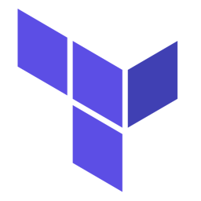

</img>

- :computer: Software Engineer II at [Codeweavers](https://www.codeweavers.net/), working in Backend.
- :student: First-class CS Alumni from [Staffordshire University](https://www.staffs.ac.uk/), with a specialization in Software Development and Engineering.
- :video_game: Former background in GameDev, with previous experience as a Games Tester.
 

</img>

In professional roles, I've worked with:

<table align="center">
<tr>
<td align="center">

C#
</td>
<td align="center">

.NET
</td>
<td align="center">

NUnit
</td>
<td align="center">

Moq
</td>
<td align="center">

PostgreSQL
</td>
<td align="center">

AWS
</td>
<td align="center">

Terraform
</td><td align="center">

SQL Server
</td>
<td align="center">

NHibernate
</td>
<tr>
</table>

Through my own projects or curiosity, I have also worked with:

<table align="center">
<tr>
<td align="center">

Ubuntu / Debian
</td>
<td align="center">

C++
</td>
<td align="center">

Python
</td>
<td align="center">

Git
</td>
<td align="center">

Bash
</td>
<td align="center">

Raspberry Pi OS
</td>
<td align="center">

Qt
</td>
<td align="center">

CMake
</td>
</tr>
<tr>
<td align="center">

Microsoft Azure
</td>
<td align="center">

JavaScript
</td>
<td align="center">

WebAssembly
</td>
<td align="center">

GitHub Actions
</td>
<td align="center">

React
</td>
<td align="center">

SQLite
</td>
</tr>
</table>

*I am also [AZ-900 (Microsoft Azure Fundamentals) Certified](https://learn.microsoft.com/en-gb/users/not-ed/credentials/84505f8dcf8a6f35)* :grin:.

</img>

<!-- Content is removed and re-populated here automatically by Github actions, do not put anything here manually.-->
<!-- HISTORY_START -->

> ### Sun. 05 July
>
>  "[Created stubbed AniListWatchlistService for most recent manga/anime seen](https://github.com/not-ed/whoami-api/commit/c3ac59147ad39762790585cdfc2769c8caa806ef)" in [not-ed/whoami-api](https://github.com/not-ed/whoami-api).

> ### Sat. 20 June
>
>  "[Added FeedItem mapping for Github PublicEvents](https://github.com/not-ed/whoami-api/commit/14896f3b729524b83a5f4b426f671402fa971364)" in [not-ed/whoami-api](https://github.com/not-ed/whoami-api).
>
>  "[Changed color code for unknown Github event feed items](https://github.com/not-ed/whoami-api/commit/491505822797af508fad2615d196bde2c05528bb)" in [not-ed/whoami-api](https://github.com/not-ed/whoami-api).

> ### Thu. 10 August
>
>  Made [not-ed/events-sandbox](https://github.com/not-ed/events-sandbox) public.

> ### Thu. 18 June
>
>  "[Replaced Github API-based links from GithubEventRepository.Url with lazy constructed URL from repo name](https://github.com/not-ed/whoami-api/commit/dfadcff74e5b55c39750956b2bf7d30e5f0f2c0f)" in [not-ed/whoami-api](https://github.com/not-ed/whoami-api).
>
>  "[Created GitHubFeedItemFactory for mapping Github Event types into FeedItems (with mappings for WatchEvents and unknown Events)](https://github.com/not-ed/whoami-api/commit/8c1b31c61b9c25e6a8c1c3ee86dcfd5a8b15ab28)" in [not-ed/whoami-api](https://github.com/not-ed/whoami-api).

<!-- HISTORY_END -->

</img>
<!-- Content is removed and re-populated here automatically by Github actions, do not put anything here manually.-->
<!-- FEED_START -->

- [Customary "How I Update This Blog" Post](https://blog.not-ed.com/posts/customary-how-i-update-this-blog-post/) - 11 Apr. 2026.
- [Yes, it counts.](https://blog.not-ed.com/posts/yes-it-counts/) - 15 Nov. 2024.
- [Using Web Scraping to Create a Patch Notes Bot in Python](https://blog.not-ed.com/posts/web-scraping-patch-notes/) - 20 Jul. 2021.
- ["Proper" Languages: Who Does This Help?](https://blog.not-ed.com/posts/proper-languages/) - 16 Apr. 2021.
- [Digitizing Sprites and Textures Through Code for DOOMify](https://blog.not-ed.com/posts/digitizing-sprites-doomify/) - 18 Mar. 2021.
<!-- FEED_END -->

