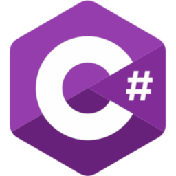
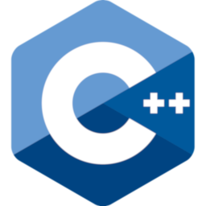
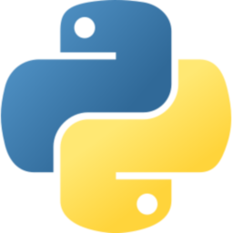
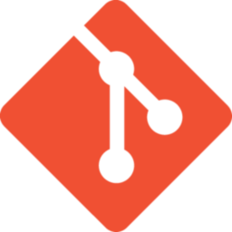
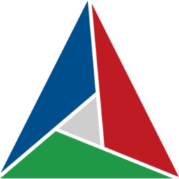

</img>

- :computer: Software Engineer II at [Codeweavers](https://www.codeweavers.net/), working in Backend.
- :student: First-class CS Alumni from [Staffordshire University](https://www.staffs.ac.uk/), with a specialization in Software Development and Engineering.
- :video_game: Former background in GameDev, with previous experience as a Games Tester.
 

</img>

In professional roles, I've worked with:

<table align="center">
<tr>
<td align="center">

C#
</td>
<td align="center">

.NET
</td>
<td align="center">

NUnit
</td>
<td align="center">

Moq
</td>
<td align="center">

PostgreSQL
</td>
<td align="center">

SQL Server
</td>
<td align="center">

NHibernate
</td>
<tr>
</table>

Through my own projects or curiosity, I have also worked with:

<table align="center">
<tr>
<td align="center">

Ubuntu / Debian
</td>
<td align="center">

C++
</td>
<td align="center">

Python
</td>
<td align="center">

Git
</td>
<td align="center">

Bash
</td>
<td align="center">

Raspberry Pi OS
</td>
<td align="center">

Qt
</td>
<td align="center">

CMake
</td>
</tr>
<tr>
<td align="center">

Microsoft Azure
</td>
<td align="center">

JavaScript
</td>
<td align="center">

WebAssembly
</td>
<td align="center">

GitHub Actions
</td>
<td align="center">

React
</td>
<td align="center">

SQLite
</td>
</tr>
</table>

*I am also [AZ-900 (Microsoft Azure Fundamentals) Certified](https://learn.microsoft.com/en-gb/users/not-ed/credentials/84505f8dcf8a6f35)* :grin:.

</img>

<!-- Content is removed and re-populated here automatically by Github actions, do not put anything here manually.-->
<!-- HISTORY_START -->

> ### Wed. 15 April
>
>  "[Created a minimal ASP.NET API project for serving the whoami API](https://github.com/not-ed/whoami-api/commit/f7d106674dfebf96a45d5ea60b2cd78d31d875a5)" in [not-ed/whoami-api](https://github.com/not-ed/whoami-api).

> ### Sat. 28 March
>
>  "[Created README inside of azure-functions](https://github.com/not-ed/whoami-api/commit/cd69243525f9afa0d5a92b6465d75d3f8ce1a553)" in [not-ed/whoami-api](https://github.com/not-ed/whoami-api).
>
>  "[Refactor: moved Azure Functions related artefacts into azure-functions directory](https://github.com/not-ed/whoami-api/commit/63e592a803866d823e4581d3f80a9b511ee93c7e)" in [not-ed/whoami-api](https://github.com/not-ed/whoami-api).
>
>  "[Created database-migrations directory to house schema migrations for SQL Server](https://github.com/not-ed/whoami-api/commit/4b941337eb7fa3f3e861bf981842ce3557ae63e2)" in [not-ed/whoami-api](https://github.com/not-ed/whoami-api).
>
>  "[Added logic for github_events_import Function](https://github.com/not-ed/whoami-api/commit/ad88b969cf47fd09a28230b7096a4f947843f43b)" in [not-ed/whoami-api](https://github.com/not-ed/whoami-api).
>
>  "[Added .funcignore file](https://github.com/not-ed/whoami-api/commit/17bbaf737f26f9c4aa88fb04e719b69983dbee2d)" in [not-ed/whoami-api](https://github.com/not-ed/whoami-api).
>
>  "[Added .vscode/ to .gitignore file](https://github.com/not-ed/whoami-api/commit/6ad1e7acf91dcaf8321b62e3b8a33ede179f6958)" in [not-ed/whoami-api](https://github.com/not-ed/whoami-api).
>
>  "[Added logic for github_events_import Function](https://github.com/not-ed/whoami-api/commit/c5920ef5f5156d13e9939a06cf1a2310415f9678)" in [not-ed/whoami-api](https://github.com/not-ed/whoami-api).

> ### Mon. 23 March
>
>  "[Added](https://github.com/not-ed/whoami-api/commit/722dc022926f78561fef8ea3b0c87cfbbf6cfcbc)" in [not-ed/whoami-api](https://github.com/not-ed/whoami-api).

<!-- HISTORY_END -->

</img>
<!-- Content is removed and re-populated here automatically by Github actions, do not put anything here manually.-->
<!-- FEED_START -->

- [Customary "How I Update This Blog" Post](https://blog.not-ed.com/posts/customary-how-i-update-this-blog-post/) - 11 Apr. 2026.
- [Yes, it counts.](https://blog.not-ed.com/posts/yes-it-counts/) - 15 Nov. 2024.
- [Using Web Scraping to Create a Patch Notes Bot in Python](https://blog.not-ed.com/posts/web-scraping-patch-notes/) - 20 Jul. 2021.
- ["Proper" Languages: Who Does This Help?](https://blog.not-ed.com/posts/proper-languages/) - 16 Apr. 2021.
- [Digitizing Sprites and Textures Through Code for DOOMify](https://blog.not-ed.com/posts/digitizing-sprites-doomify/) - 18 Mar. 2021.
<!-- FEED_END -->

