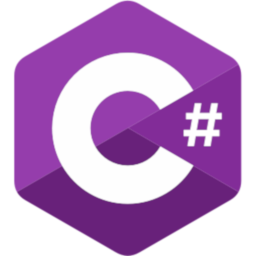
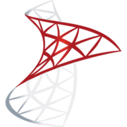
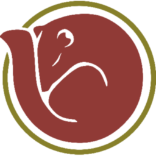
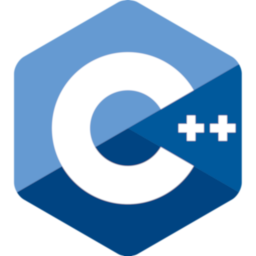
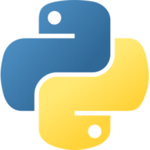
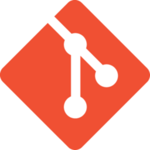
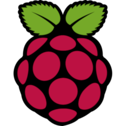
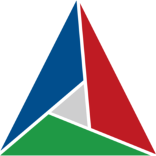

</img>

- :computer: Software Engineer II at [Codeweavers](https://www.codeweavers.net/), working in Backend.
- :student: First-class CS Alumni from [Staffordshire University](https://www.staffs.ac.uk/), with a specialization in Software Development and Engineering.
- :video_game: Former background in GameDev, with previous experience as a Games Tester.
 

</img>

In professional roles, I've worked with:

<table align="center">
<tr>
<td align="center">

C#
</td>
<td align="center">

.NET
</td>
<td align="center">

NUnit
</td>
<td align="center">

Moq
</td>
<td align="center">

PostgreSQL
</td>
<td align="center">

AWS
</td>
<td align="center">

Terraform
</td><td align="center">

SQL Server
</td>
<td align="center">

NHibernate
</td>
<tr>
</table>

Through my own projects or curiosity, I have also worked with:

<table align="center">
<tr>
<td align="center">

Ubuntu / Debian
</td>
<td align="center">

C++
</td>
<td align="center">

Python
</td>
<td align="center">

Git
</td>
<td align="center">

Bash
</td>
<td align="center">

Raspberry Pi OS
</td>
<td align="center">

Qt
</td>
<td align="center">

CMake
</td>
</tr>
<tr>
<td align="center">

Microsoft Azure
</td>
<td align="center">

JavaScript
</td>
<td align="center">

WebAssembly
</td>
<td align="center">

GitHub Actions
</td>
<td align="center">

React
</td>
<td align="center">

SQLite
</td>
</tr>
</table>

*I am also [AZ-900 (Microsoft Azure Fundamentals) Certified](https://learn.microsoft.com/en-gb/users/not-ed/credentials/84505f8dcf8a6f35)* :grin:.

</img>

<!-- Content is removed and re-populated here automatically by Github actions, do not put anything here manually.-->
<!-- HISTORY_START -->

> ### Sun. 16 August
>
>  "[Added HTTP-Trigger Function for surfacing most recent approved AniList title](https://github.com/not-ed/whoami-api/commit/cb1f119dc6fb9eff341be7c0113e8c39f2cce6ba)" in [not-ed/whoami-api](https://github.com/not-ed/whoami-api).

> ### Mon. 10 August
>
>  "[Created Module for sending Discord Webhook message to notify of new AniList titles pending approval.](https://github.com/not-ed/whoami-api/commit/ca33f8e419321fe657d041e495e7dd7bb3e5c482)" in [not-ed/whoami-api](https://github.com/not-ed/whoami-api).
>
>  Pushed a commit to [not-ed/whoami-api](https://github.com/not-ed/whoami-api).

> ### Sat. 01 August
>
>  "[Added Azure Function logic for approving / denying pending AniList titles](https://github.com/not-ed/whoami-api/commit/a2556e01a70202587929c2ed3a2d2c66aba387ee)" in [not-ed/whoami-api](https://github.com/not-ed/whoami-api).
>
>  Starred [beekeeper-studio/beekeeper-studio](https://github.com/beekeeper-studio/beekeeper-studio).

> ### Sun. 26 July
>
>  "[Added stub HTTP function triggers for allowing/denying display of saved AniList titles](https://github.com/not-ed/whoami-api/commit/365d75f8767548f278f0f004ff4da5a146288571)" in [not-ed/whoami-api](https://github.com/not-ed/whoami-api).
>
>  "[Refactor: moved environment variable retrieval into dedicated Module](https://github.com/not-ed/whoami-api/commit/ca4068792d317e16b790a8aa10d6f48a7c9e1329)" in [not-ed/whoami-api](https://github.com/not-ed/whoami-api).
>
>  "[Refactor: moved SQL Server connection creation for Azure Functions into factory module](https://github.com/not-ed/whoami-api/commit/b9ebab0eece957d992a16b5558f0b43eb916ee98)" in [not-ed/whoami-api](https://github.com/not-ed/whoami-api).

<!-- HISTORY_END -->

</img>
<!-- Content is removed and re-populated here automatically by Github actions, do not put anything here manually.-->
<!-- FEED_START -->

- [Customary "How I Update This Blog" Post](https://blog.not-ed.com/posts/customary-how-i-update-this-blog-post/) - 11 Apr. 2026.
- [Yes, it counts.](https://blog.not-ed.com/posts/yes-it-counts/) - 15 Nov. 2024.
- [Using Web Scraping to Create a Patch Notes Bot in Python](https://blog.not-ed.com/posts/web-scraping-patch-notes/) - 20 Jul. 2021.
- ["Proper" Languages: Who Does This Help?](https://blog.not-ed.com/posts/proper-languages/) - 16 Apr. 2021.
- [Digitizing Sprites and Textures Through Code for DOOMify](https://blog.not-ed.com/posts/digitizing-sprites-doomify/) - 18 Mar. 2021.
<!-- FEED_END -->

