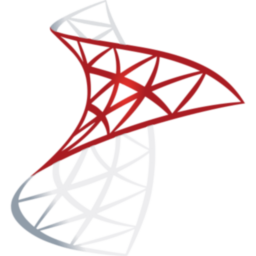

</img>

- :computer: Software Engineer II at [Codeweavers](https://www.codeweavers.net/), working in Backend.
- :student: First-class CS Alumni from [Staffordshire University](https://www.staffs.ac.uk/), with a specialization in Software Development and Engineering.
- :video_game: Former background in GameDev, with previous experience as a Games Tester.
 

</img>

In professional roles, I've worked with:

<table align="center">
<tr>
<td align="center">

C#
</td>
<td align="center">

.NET
</td>
<td align="center">

NUnit
</td>
<td align="center">

PostgreSQL
</td>
<td align="center">

SQL Server
</td>
<td align="center">

NHibernate
</td>
<tr>
</table>

Through my own projects or curiosity, I have also worked with:

<table align="center">
<tr>
<td align="center">

Ubuntu / Debian
</td>
<td align="center">

C++
</td>
<td align="center">

Python
</td>
<td align="center">

Git
</td>
<td align="center">

Bash
</td>
<td align="center">

Raspberry Pi OS
</td>
<td align="center">

Qt
</td>
<td align="center">

CMake
</td>
</tr>
<tr>
<td align="center">

Microsoft Azure
</td>
<td align="center">

JavaScript
</td>
<td align="center">

WebAssembly
</td>
<td align="center">

GitHub Actions
</td>
<td align="center">

React
</td>
<td align="center">

SQLite
</td>
</tr>
</table>

*I am also [AZ-900 (Microsoft Azure Fundamentals) Certified](https://learn.microsoft.com/en-gb/users/not-ed/credentials/84505f8dcf8a6f35)* :grin:.

</img>

<!-- Content is removed and re-populated here automatically by Github actions, do not put anything here manually.-->
<!-- HISTORY_START -->

> ### Tue. 16 December
>
>  "[Added descending ordering for weigh-in entries on WeightJournalPageViewModel](https://github.com/not-ed/acai/commit/26d2cd4e91db9c018acb0135acea3555e7505324)" in [not-ed/acai](https://github.com/not-ed/acai).

> ### Sun. 14 December
>
>  "[Added proper implementation for deleting Weigh In entries on Weight Journal Page](https://github.com/not-ed/acai/commit/9264d83b4f8669e942b466f76a4521e05024859d)" in [not-ed/acai](https://github.com/not-ed/acai).
>
>  "[Corrected mapping and display of Weight Journal entries to WeightJournalPage](https://github.com/not-ed/acai/commit/11d71e50610c3c92d60464f87ad6e69f9dd304f3)" in [not-ed/acai](https://github.com/not-ed/acai).
>
>  "[Made Weight Journal Gateway accessible in Acai Sessions](https://github.com/not-ed/acai/commit/f258e292acc8877dea4d98dc8e90e77a51b26951)" in [not-ed/acai](https://github.com/not-ed/acai).
>
>  "[Added Floating Action Button to WeightJournalPage](https://github.com/not-ed/acai/commit/6d8f73f5b00cc570cf6fc7f7ab81fa1548a4df9d)" in [not-ed/acai](https://github.com/not-ed/acai).
>
>  "[Added implementation logic for UpdateExistingWeighIn with tests](https://github.com/not-ed/acai/commit/b372ed6d540aad5bf3ccbb6e645bb784eef43e9f)" in [not-ed/acai](https://github.com/not-ed/acai).
>
>  "[Added implementation for DeleteWeighIn with tests](https://github.com/not-ed/acai/commit/82f173e20e7b62dd7abbaab0344b7dc0f50d64f1)" in [not-ed/acai](https://github.com/not-ed/acai).
>
>  "[Added implementation logic for GetAllWeighIns with tests](https://github.com/not-ed/acai/commit/1be107e74626a8fb74a9a52afce477964ddef732)" in [not-ed/acai](https://github.com/not-ed/acai).

> ### Wed. 10 December
>
>  "[Added GetAllWeighIns signature to IWeightJournalGateway](https://github.com/not-ed/acai/commit/9fb0561c2733dc8dc4f9613c4a34ad332d169977)" in [not-ed/acai](https://github.com/not-ed/acai).

> ### Mon. 08 December
>
>  "[Implemented CreateNewWeighIn logic with tests](https://github.com/not-ed/acai/commit/61d5eb7b2e2c4b45874e7debcc7652b6b2c9ce35)" in [not-ed/acai](https://github.com/not-ed/acai).

<!-- HISTORY_END -->

</img>
<!-- Content is removed and re-populated here automatically by Github actions, do not put anything here manually.-->
<!-- FEED_START -->

- [Customary "How I Update This Blog" Post](https://blog.not-ed.com/posts/customary-how-i-update-this-blog-post/) - 02 Feb. 2025.
- [Yes, it counts.](https://blog.not-ed.com/posts/yes-it-counts/) - 15 Nov. 2024.
- [Using Web Scraping to Create a Patch Notes Bot in Python](https://blog.not-ed.com/posts/web-scraping-patch-notes/) - 20 Jul. 2021.
- ["Proper" Languages: Who Does This Help?](https://blog.not-ed.com/posts/proper-languages/) - 16 Apr. 2021.
- [Digitizing Sprites and Textures Through Code for DOOMify](https://blog.not-ed.com/posts/digitizing-sprites-doomify/) - 18 Mar. 2021.
<!-- FEED_END -->

